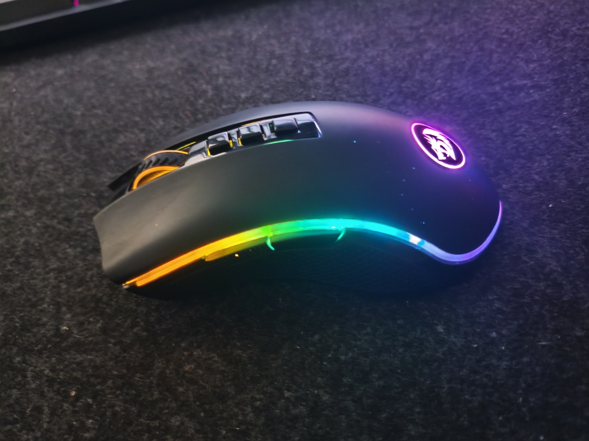
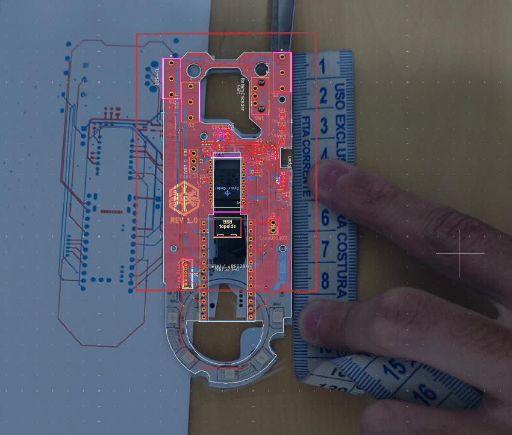
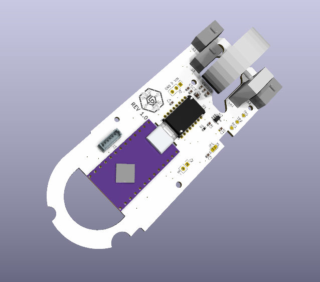
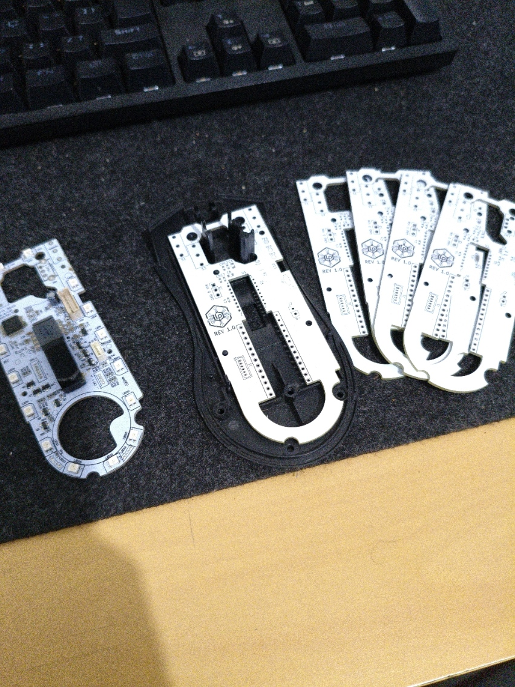
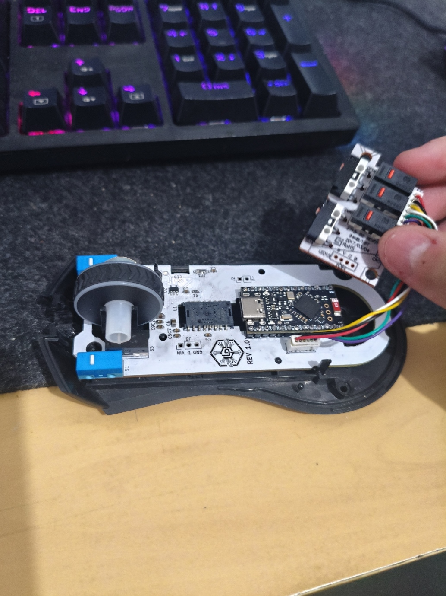

# Custom ZMK Wireless Mouse: Redragon Cobra Mod 🖱️🐍

> **Hardware & Firmware Engineering Portfolio**

<p align="center">
  
</p>

A comprehensive hardware and firmware project focused on creating a custom wireless mouse, built upon the Zephyr/ZMK ecosystem. A core idea behind this project was to create a versatile tool that seamlessly transitions between my work and home environments. 

The project involved **designing a custom PCB**, specifically tailored to fit perfectly within the ergonomic shell of a **Redragon Cobra**. A key goal was to reuse as many components from the original mouse as possible—such as the switches and the wheel mechanism—transforming a traditional wired mouse into a premium, high-performance wireless tool.

Focused on energy efficiency, multiple productivity layers (Office/Gaming), and RGB Underglow lighting, the development overcame several electrical and logical challenges, especially in integrating high-consumption components (LEDs) with a *low-power* sensor architecture.

## 📸 Project Gallery (Build Log)

<div align="center">
  
  
</div>
<br/>
<div align="center">
  
  
</div>

## 🛠️ Hardware Specifications & Custom PCB

The hardware architecture was custom-developed to reuse the Redragon Cobra shell and its main functional components (like the original clicks and side switches). The integration includes:

*   **Microcontroller:** SuperMini nRF52 (nice!nano alternative based on the nRF52840)
*   **Optical Sensor:** PixArt PMW3610 (Since the original was a wired sensor, it was replaced with this Low-Power architecture ideal for wireless)
*   **Scroll / Wheel:** TTC Gold 13mm Rotary Encoder (The original encoder was damaged and an exact replacement wasn't available, so it was swapped for this equivalent TTC Gold)
*   **Lighting:** WS2812 LED Strip (9 LEDs for underglow)
*   **Battery:** 1200mAh 3.7V LiPo (Model 503048, 5x30x48mm)

## ✨ Features and Functionalities

The firmware was designed to act as a hybrid device (Mouse + Keyboard), allowing the execution of complex macros and direct shortcuts on the board.

### Layer System
*   **Gaming Layer (Default):** Standard mouse commands (LCLK, RCLK, MCLK, MB4, MB5) with high-sensitivity scroll.
*   **Office Layer:** Transforms the mouse into a productivity tool focused on **Simulink** environments. Features built-in macros (`Ctrl + .`, `C`, `E`, `N`, `T`, `E`, `R`) injected in 30ms for quick alignments, compiling, and block organization.
*   **Utility Layer (Bluetooth Modifier):** Holding the "Top 3" button transforms the main clicks into a Bluetooth remote control (Force Slot 0, Force Slot 1, Format Memory).

### Physical Combos
*   **MCLK + LCLK:** Toggle RGB On/Off.
*   **MCLK + RCLK:** Next RGB effect.
*   **Bottom Button:** 1-Click Tap Dance triggers **Soft Off** (Deep sleep via software).

## ⚡ Engineering Notes & Hardware Solutions

During development, several electrical integration and mechanical design bottlenecks were resolved. If you intend to replicate this project, pay attention to the following design decisions and topology rules:

### 1. PCB Modeling and Component Alignment
Without schematics for the original Redragon Cobra PCB, the new board had to be modeled from scratch. The PCB outline and component placements were reverse-engineered using top-down photos of the original board and a physical ruler for scale. 

### 2. 3D Modeling for Fitment Check
To ensure the SuperMini, LiPo battery, and all reused components would fit within the limited internal space of the original shell, a full 3D model of the assembly was created. This step was crucial to guarantee clearance for the new components without modifying the external plastics.

### 3. Wired to Wireless Conversion Challenges
Because the original Redragon Cobra was a wired mouse, several structural challenges were addressed:
*   **Sensor Swap:** The original power-hungry wired sensor had to be replaced by the low-power PixArt PMW3610.
*   **Charging Port Routing:** To utilize the original cable exit hole at the front of the mouse for charging, a custom-made male-to-female USB-C cable was fabricated. It routes power from the front of the mouse internally back to the SuperMini microcontroller.

### 4. Power Separation (Brownout Prevention)
The 9-LED WS2812 strip consumes up to ~180mA, which exceeds the chronic regulation capacity of the board's LDO, causing a *brownout* (VCC drop to ~2.6V) if powered by the 3.3V pin.
*   **Solution:** The board's VCC (3.3V) is dedicated **exclusively** to the PMW3610 sensor and buttons. The WS2812 strip's power is routed directly to the `B+ / RAW` pin (Raw battery voltage).

### 5. SPI Bus and Ext_Power Backfeeding
By default, ZMK ties the power off (idle) to the LEDs. When entering a 30s sleep, the VCC pin was cut, but the SPI bus was not. The PMW3610 sensor "sucked" reverse current through the data pins (generating 2.66V parasitic voltage on VCC), resulting in a complete Bluetooth lockup.
*   **Solution (`.conf`):** 
    ```text
    CONFIG_ZMK_EXT_POWER=y
    CONFIG_ZMK_RGB_UNDERGLOW_EXT_POWER=n
    ```
    This keeps the 3.3V active and prohibits the LEDs from cutting the main VCC, allowing the RGB to be turned off purely via software (black color), while the sensor safely enters its native *Low Power Mode*.

### 6. Boot Noise (LEDs flashing electronic junk)
When powering up the board, the nRF52 has floating pins that injected noise into the WS2812 strip's data channel.
*   **Solution (`.overlay`):** Insertion of the `bias-pull-down;` property on the `pinctrl` MOSI pin to anchor the signal at 0V during boot, coupled with the initialization delay `init-delay-ms = <300>;` to wait for the strip's capacitors.

### 7. Physical Surface Conditioning
**Known Limitation:** The PixArt PMW3610 has extremely weak optical emission to save battery. It **does not work properly on wool or felt mousepads**, as the three-dimensional fibers blur the lens. It requires the use of traditional microfiber (cloth/fabric) mousepads or rigid surfaces.

---
*Status: v1.0 (Full logical functionality validated in Hardware).*